# Giving model feedback (correcting Nighthawk's mistakes)

When Nighthawk makes an incorrect classification, submitting feedback will help improve the model's performance in the future. This document outlines the steps for submitting feedback on Nighthawk annotations using [Raven Pro](https://ravensoundsoftware.com/software/raven-pro/) sound analysis software.

[Jump to FAQ](#FAQ) (bottom of page).

## Step 1: Run Nighthawk with `--raven-output`.

Run Nighthawk across a file and output a Raven selection table with the `--raven-output` flag. Here, we do this on the test3.wav file included in this repository.

```         
nighthawk test_inputs/test3.wav --raven-output
```

This command creates the output files `test_inputs/test3_detections.txt` and `test_inputs/test3_detections.csv`.

## Step 2: Open audio and selection table in Raven Pro.

In Raven Pro, use File -\> Open Sound Files and choose the input audio file (in this case, `test3.wav`). Open a spectrogram view with your favored parameters. Then, use File -\> Open Selection Table and choose the corresponding .txt output (in this case, `test3_detections.txt)`. Your Raven window will now look something like this:

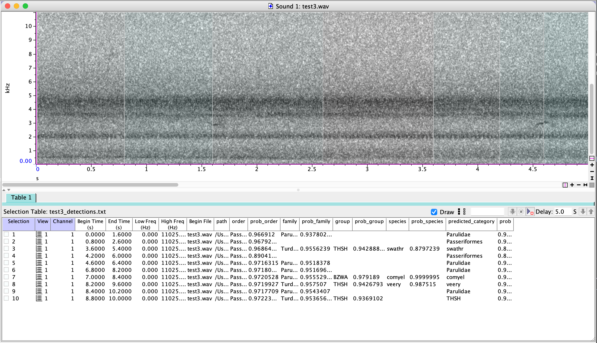

## Step 3: Add annotation columns to the selection table.

Create additional annotation columns in the selection table for feedback. Right-click on the selection table header and select "Add Annotation Column":

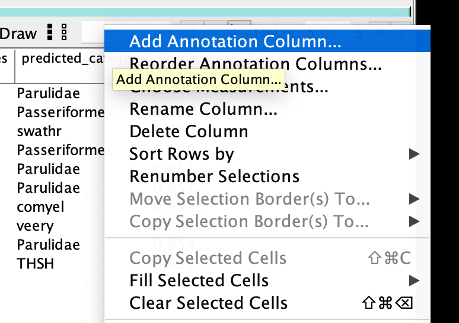

Name the new annotation column `category_update`:

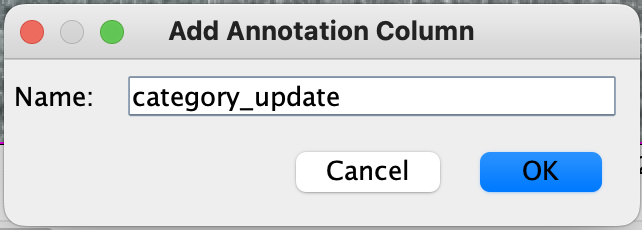

You have now added an empty `category_update` column to the selection table:

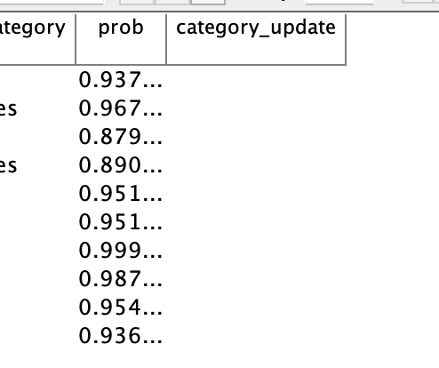

## Step 4: Specify feedback in the `category_update` column.

There are four types of feedback you can provide: (1) specifying false positives; (2) correcting any incorrect identifications; (3) confirming Nighthawk's identifications; and (4) adding missing detections. Any of these are helpful - you can provide one, two, or all types of feedback. For example, you can provide feedback on only false positives (and not confirm, correct, or add anything).

### Specify false positives with `n`

If any Nighthawk detections actually contain no flight calls, enter `n` in the `category_update` column to specify that there are *no* flight calls in the selection. Use `n` for any of the following cases:

-   Insects, frogs, or other non-bird animals
-   Vocalizations of migratory birds that are **not** flight calls
-   Vocalizations of non-migratory birds
-   Human-made noise
-   Any other sound that is not a flight call

**IMPORTANT:** There must be **NO** flight calls present in the selection to use `n`. **DO NOT** use `n` if there are any flight calls present in the selection.

Be sure to save your selection table with any updates!

#### Example

The selection in question:

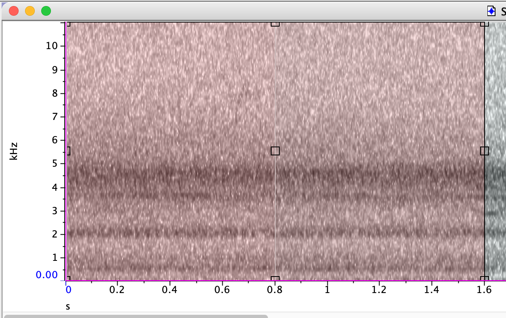

Nighthawk thinks there is a Parulidae (warbler) call here, but we don't see an obvious call. Enter `n` in the `category_update` column to specify that there are *no* flight calls in this selection:

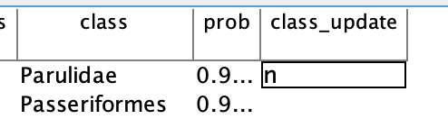

### Correct identifications by specifying the correct category and shrinking the selection

For Nighthawk detections that are identified incorrectly (or could be identified more accurately) in the `predicted_category` column, do the following:

1.  Enter the correct classification in the `category_update` column. The entry must be one of the following:

    -   A valid species-level eBird code (the `code` column in [nighthawk/taxonomy/ebird_taxonomy.csv](../../nighthawk/taxonomy/ebird_taxonomy.csv))
    -   A valid species-level four-letter code (the `SPEC` column in [nighthawk/taxonomy/IBP-AOS-LIST21.csv](../../nighthawk/taxonomy/IBP-AOS-LIST21.csv))
    -   A valid group (the `group` column in [nighthawk/taxonomy/groups_ebird_codes.csv](../../nighthawk/taxonomy/groups_ebird_codes.csv))
    -   A valid family (the Latin word from the `family` column in [nighthawk/taxonomy/ebird_taxonomy.csv](../../nighthawk/taxonomy/ebird_taxonomy.csv))
    -   A valid order (the `order` column in [nighthawk/taxonomy/ebird_taxonomy.csv](../../nighthawk/taxonomy/ebird_taxonomy.csv))

2.  Shrink the selection to cover only the identified call.

3.  Be sure to save your selection table with any updates!

#### Example

The selection in question:

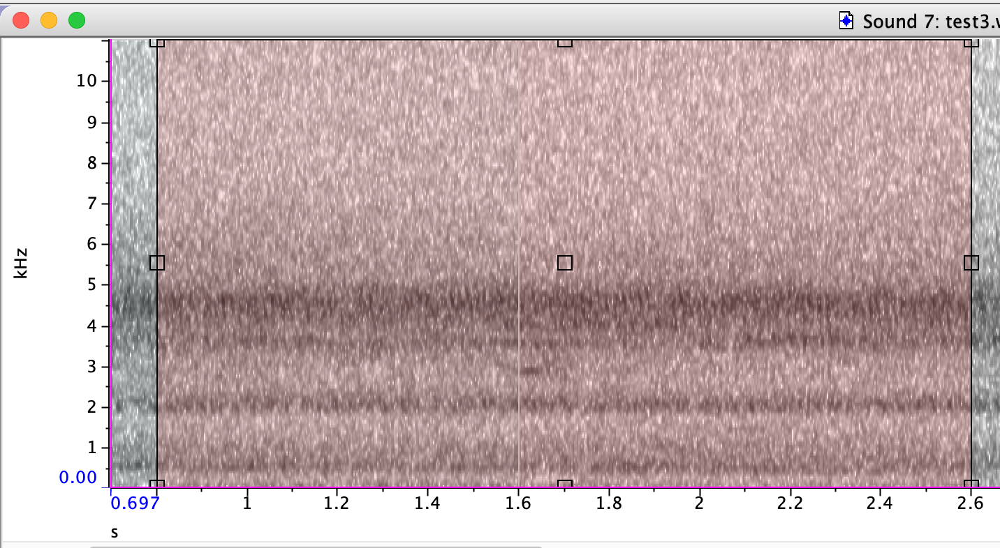

Nighthawk thinks there is a Passeriformes (passerine) call here. We think it can be confidently identified to family Turdidae (thrushes), so we enter `Turdidae` in the `category_update` column:

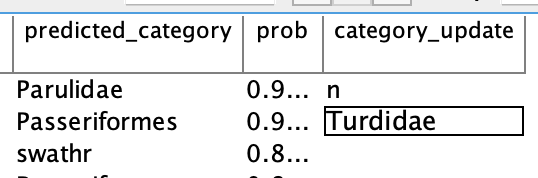

We make sure to shrink the selection so it defines a box around the specific call in question:

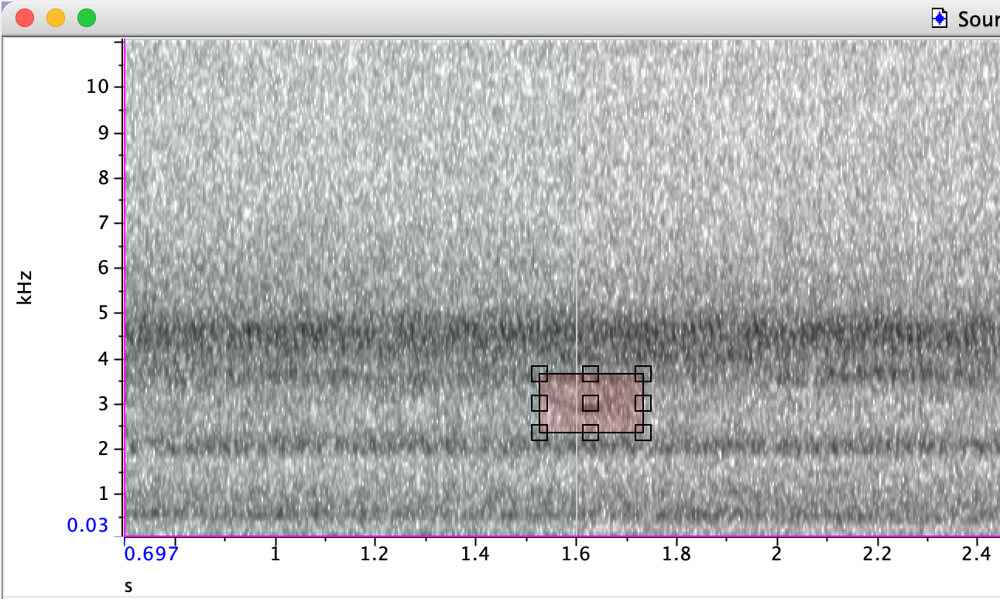

### Confirm identifications by using `c` and shrinking the selection

For Nighthawk detections that are identified correctly (in the `class` column), do the following steps:

1.  Enter `c` in the `category_update` column.
2.  Shrink the selection to cover only the correctly-identified call.
3.  Ensure any nearby flight calls are also boxed.
4.  Be sure to save your selection table with any updates!

#### Example

The selection in question:

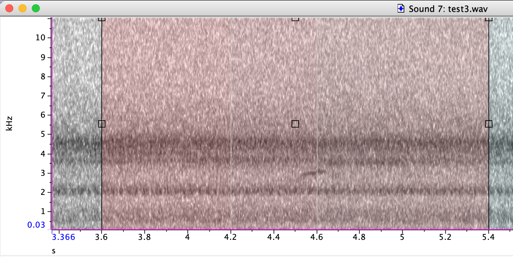

We think this is indeed swathr (Swainson's Thrush), so we enter `c` in the category_update column:

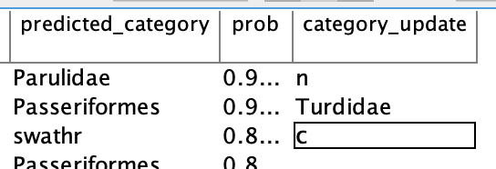

We make sure to shrink the selection so it defines a box around the specific call in question:

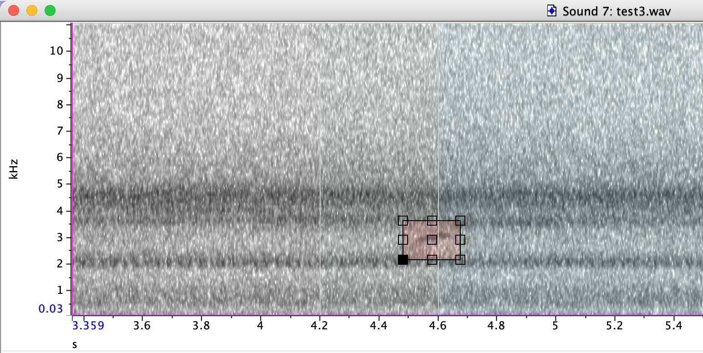

### Add any missed detections by creating a new selection

If you encounter flight calls that were not detected by Nighthawk, you can create a new selection and add the correct classification to the `category_update` column:

1.  Draw a new selection box around the call.
2.  Commit the selection by pressing Enter.
3.  Add the correct ID to the `category_update` column corresponding to the new selection.
4.  Be sure to save your selection table with any updates!

**IMPORTANT**: DO NOT add selections for vocalizations that are not flight calls.

#### Example

Note that for this example, which uses `test3.wav`, I have deleted some of Nighthawk's detections in order to demonstrate how to add new detections. If you run Nighthawk on `test3.wav`, you will likely not find any missed calls.

The audio in question. We see a faint Parulidae (warbler) call that Nighthawk has not detected:

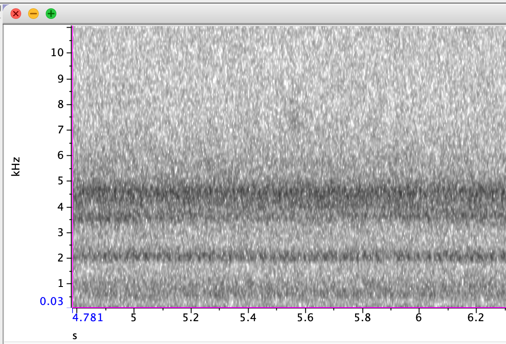

We draw a new selection box around the call. The box borders are dashed, which means we have not yet committed the selection:

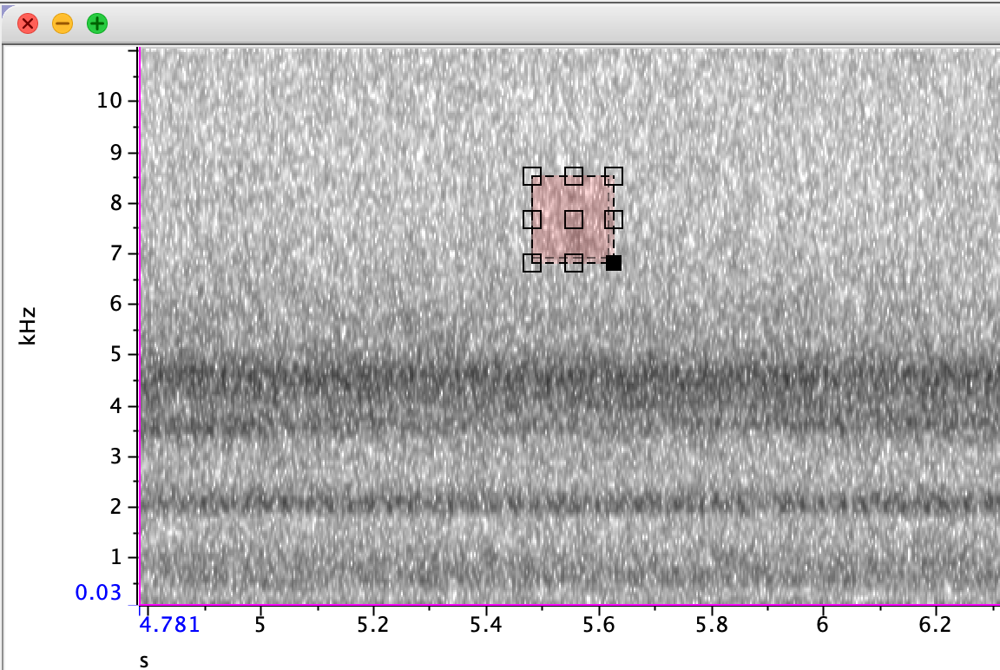

After committing the selection, the box borders are solid:


We add our ID to the `category_update` column:

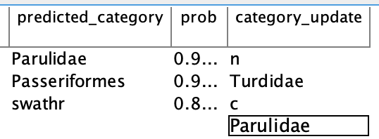

## Step 5: Save selection table, record metadata in a .yml file, and run `prep_nighthawk` to compile feedback files.

Once you are finished reviewing a file, make sure to save the selection table (.txt file). Then, create a new YAML file with metadata about the recording. A YAML file is simply a text file with a particular formatting. Use `test3.yml` as a template. The contents of that file are shown here for easy reference.

**IMPORTANT: Please ensure that the recording start time entered in your YAML file is in Universal Coordinated Time (UTC) and NOT in your local time zone.**

```         
recordist:
    name: Benjamin Van Doren
    email: vandoren@cornell.edu

location:
    name: Ithaca_House
    latitude: 42.44
    longitude: -76.50

equipment:
    microphone: Sennheiser XS Lav Mic
    recorder: iPhone 8
    accessories: Belkin charge adapter and Anker powerbank

recording_session:
    start_time_utc: 2023-05-11 01:16:00
```

You should now have three different files:

-   An audio file that was run through Nighthawk (e.g. `test3.wav`)

-   A selection table (txt) file edited in Raven (e.g. `test3_detections.txt`)

-   A YAML file with metadata about your recording (e.g. `test3.yml`)

The final step is to run a utility that comes with the Nighthawk package, called `prep_feedback`. This command-line program takes audio, txt, and yml files and outputs a single .tar.gz archive to upload to the Nighthawk developers. For example, this is how we would run `prep_feedback` on our example files:

`prep_feedback --audio test3.wav --txt test3_detections.txt --yaml test3.yml`

This outputs the following:

```         
NOTE: Please ensure that the recording start time entered
in your YAML file is in Universal Coordinated Time (UTC).

Checks passed.
Writing archive BENJAMINVANDOREN_ITHACA-HOUSE_42.44_-76.50_20230511_011600_Z.tar.gz.

Done. Please send this file to Nighthawk developers.
```

The utility has now created a new file, a .tar.gz archive called `BENJAMINVANDOREN_ITHACA-HOUSE_42.44_-76.50_20230511_011600_Z.tar.gz`.

Now, please send us your .tar.gz file. Contact Benjamin Van Doren ([vandoren\@cornell.edu](mailto:vandoren@cornell.edu)) for instructions on submitting files, or for questions about errors encountered when running `prep_feedback`. This program runs various checks on the files to make sure they are consistent with our expectations; missing columns and typos of various kinds will result in an error.

## FAQ

### Do I need to review an entire file in order to submit feedback?

No. Only entries in the `category_update` column will be incorporated into further model training. Any unreviewed detections will have blank entries in `category_update` and will be ignored.

### What if I only want to review for false positives, and not make ID corrections?

No problem! Feel free to only enter `n` in the `category_update` column where Nighthawk has returned a false positive, and leave everything else blank. All other unreviewed detections will have blank entries in `category_update` and will be ignored.

### Should I add identifications for vocalizations that are not flight calls?

No. Vocalizations that are not flight calls should be ignored (or marked as `n` if they triggered a Nighthawk detection).
