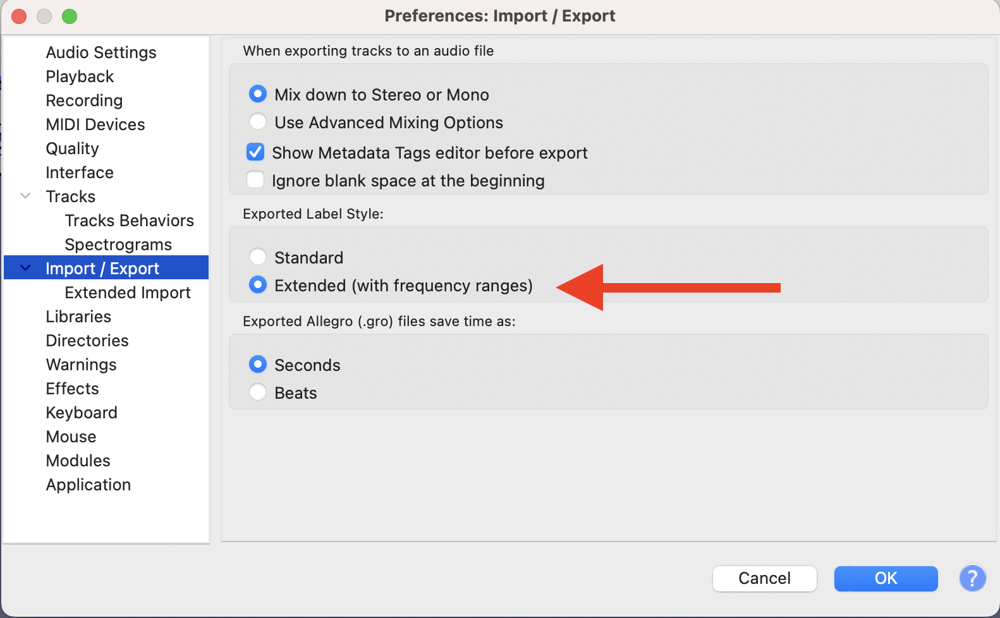
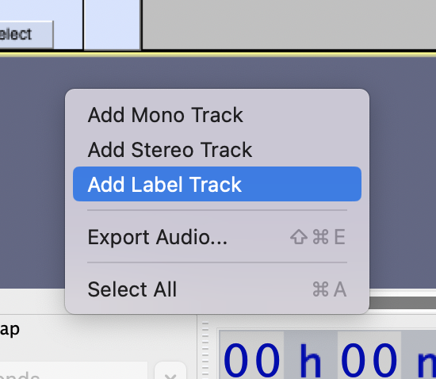
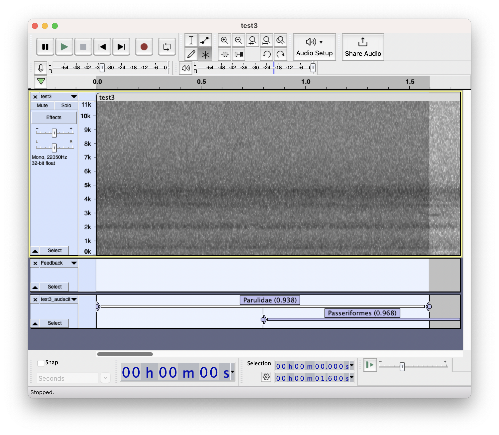
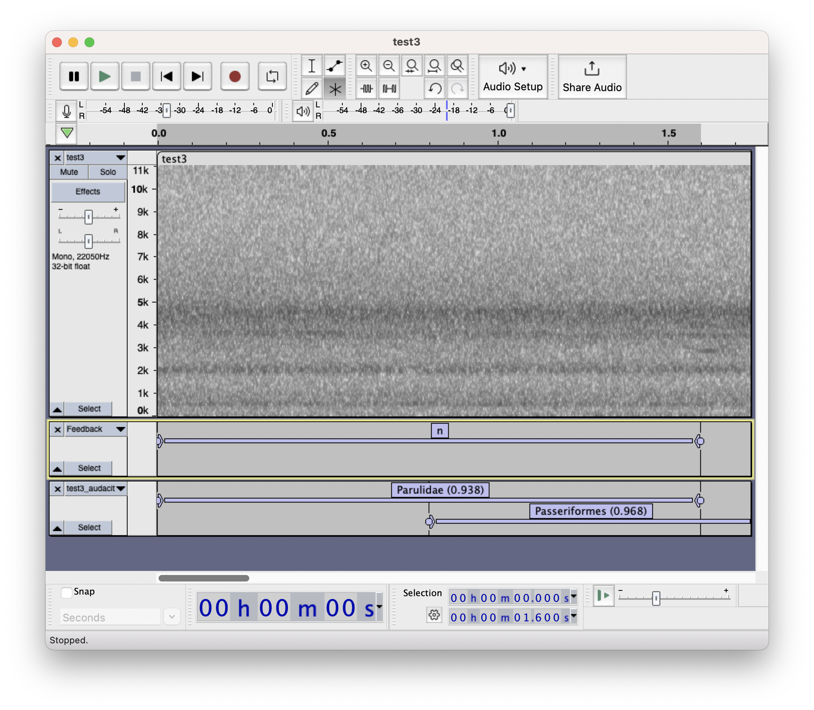
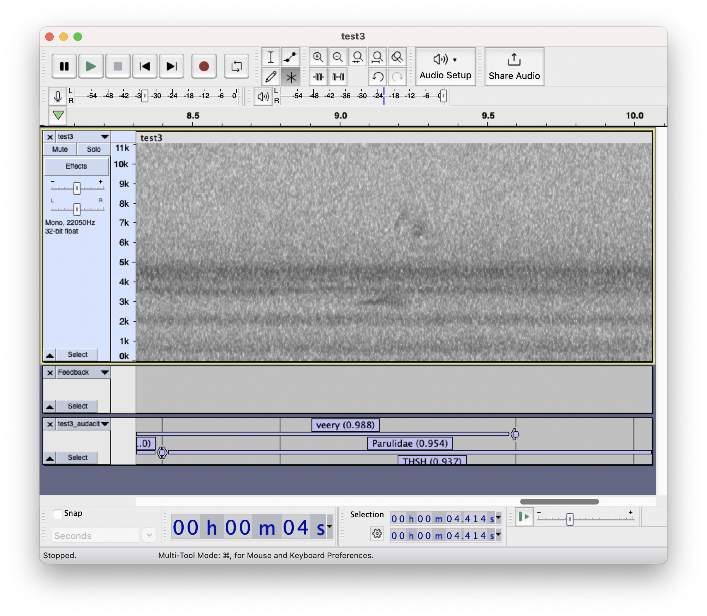
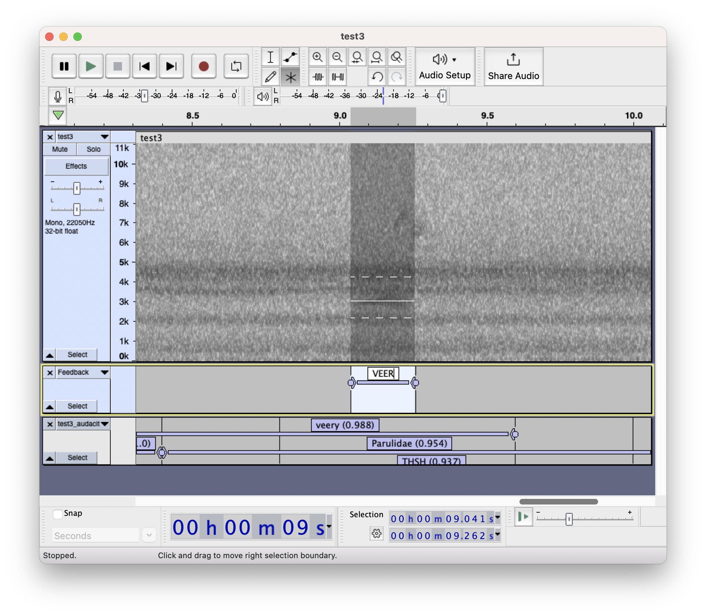
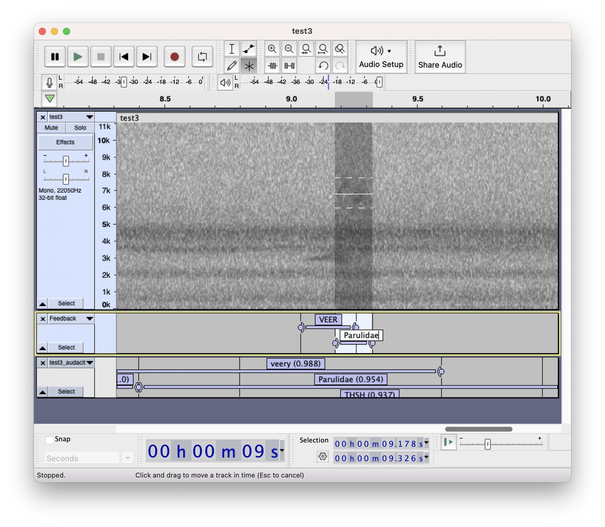

# Giving model feedback with Audacity

When Nighthawk makes an incorrect classification, submitting feedback will help improve the model's performance in the future. This document outlines the steps for submitting feedback on Nighthawk annotations using free [Audacity](https://www.audacityteam.org/) sound analysis software.

Prefer Raven instead? [View Raven Pro feedback instructions](model_feedback_raven.md).

## Step 1: Run Nighthawk with `--audacity-output`.

Run Nighthawk across a file and output an Audacity label track file with the `--audacity-output` flag. Here, we do this on the test3.wav file included in this repository.

```         
nighthawk test_inputs/test3.wav --audacity-output
```

This command creates the output files `test_inputs/test3_audacity.txt` and `test_inputs/test3_detections.csv`.

## Step 2: Open audio and Nighthawk detections in Audacity

In Audacity, use File -\> Open and choose the input audio file (in this case, `test3.wav`). Open a spectrogram view with your favored parameters.

### Include low/high frequencies in Audacity exports

Adjust your Audacity preferences so that Audacity exports frequency ranges for labels. This will ensure that your saved labels include frequency ranges:



## Step 3: Add a label track for feedback.

Make a new track to add your feedback. Right-click on empty space in the Audacity window and choose "Add Label Track." Name your label track "Feedback."



Your Audacity window will look something like this:


## Step 3: Open Nighthawk detections in Audacity

Use File -\> Import -\> Labels...and choose the corresponding `…audacity.txt` output (in this case, `test3_audacity.txt)`. This will add a second label track with Nighthawk's predictions. Your Audacity window will now look like this:


Note: if you loaded detections before creating the Feedback label track, make sure to drag the Feedback track so it is the uppermost label track.

### Exploring Nighthawk detections

You can make use of some helpful keyboard shortcuts to jump between labels in the Nighthawk detection track. On Windows, use Alt+Left and Alt+Right. On Mac, use Option+Left and Option+Right.


## Step 4: Specify feedback in the `Feedback` label track.

There are four types of feedback you can provide: (1) specifying false positives; (2) correcting any incorrect identifications; (3) confirming Nighthawk's identifications; and (4) adding missing detections. Any of these are helpful - you can provide one, two, or all types of feedback. For example, you can provide feedback on only false positives (and not confirm, correct, or add anything).

### Specify false positives with `n`

If any Nighthawk detections actually contain no flight calls, create a label in your `Feedback` track and `n` in the text field to specify that there are *no* flight calls in the selection. Use `n` for any of the following cases:

-   Insects, frogs, or other non-bird animals
-   Vocalizations of migratory birds that are **not** flight calls
-   Vocalizations of non-migratory birds
-   Human-made noise
-   Any other sound that is not a flight call

**IMPORTANT:** There must be **NO** flight calls present in the selection to use `n`. **DO NOT** use `n` if there are any flight calls present in the selection.

**IMPORTANT**: Make sure you add feedback to the `Feedback` track only.

#### Example

The detection in question:



Nighthawk thinks there is a Parulidae (warbler) call here, but we don't see an obvious call. We can mark this in two ways:

1.  Method 1: we double-click on the "Parulidae" detection in the bottom track to select audio, use the up-arrow key to move our focus up the `Feedback` track, and use CMD+B (or Edit -\> Labels -\> Add Label at Selection) to create a new label in the `Feedback` track.

2.  Method 2: we use the mouse to select the relevant region on the spectrogram where there are no calls, and then we use CMD+B (or choose Edit -\> Labels -\> Add Label at Selection) to create a new label in the `Feedback` track.

We enter `n` in the text field column to specify that there are *no* flight calls in this selection:


Our Audacity window now looks like this, with a brand new annotation in the `Feedback` track:



### Correct, confirm, or add identifications by drawing a new box in the `Feedback` track

For Nighthawk detections that you want to confirm, correct, or add, do the following:

1.  Use the mouse to draw a new box on the spectrogram that marks the location of the call in question, and then we use CMD+B (or choose Edit -\> Labels -\> Add Label at Selection) to create a new label in the `Feedback` track. Enter the ID. Your entry must be one of the following:

    -   A valid species-level eBird code (the `code` column in [nighthawk/taxonomy/ebird_taxonomy.csv](../../nighthawk/taxonomy/ebird_taxonomy.csv))
    -   A valid species-level four-letter code (the `SPEC` column in [nighthawk/taxonomy/IBP-AOS-LIST21.csv](../../nighthawk/taxonomy/IBP-AOS-LIST21.csv))
    -   A valid group (the `group` column in [nighthawk/taxonomy/groups_ebird_codes.csv](../../nighthawk/taxonomy/groups_ebird_codes.csv))
    -   A valid family (the Latin word from the `family` column in [nighthawk/taxonomy/ebird_taxonomy.csv](../../nighthawk/taxonomy/ebird_taxonomy.csv))
    -   A valid order (the `order` column in [nighthawk/taxonomy/ebird_taxonomy.csv](../../nighthawk/taxonomy/ebird_taxonomy.csv))

2.  Make sure you also draw boxes around any flight calls within 1.5 s on either side of your focal call using the same procedure.

#### Example

The detection(s) in question:



Nighthawk thinks there is a Veery call here, and also a Parulid or two. We agree. We first draw a box around the Veery call:



Since there is a Parulid call in close proximity (\< 1.5 s) from the Veery, we also have to draw a box around that one, too:



**IMPORTANT**: DO NOT add selections for vocalizations that are not flight calls, unless they are `n` selections (indicating no flight calls).

## Step 5: Export the `Feedback` label track

Once you are finished reviewing a file:

1. **Close the Nighthawk detection track so that the `Feedback` track is the only label track present.**
2. Export the remaining `Feedback` label track with your selections. To do this, choose File -\> Export -\> Export Labels.... The suggested name should be `Feedback.txt`. (If it isn't, you may have forgotten to close the Nighthawk predictions track.) Pick an informative name (e.g. in our case `test3_audacity_feedback.txt`) and save the file.

## Step 6. Record metadata in a .yml file, and run `prep_feedback` to compile feedback files.

Create a new YAML file with metadata about the recording. A YAML file is simply a text file with a particular formatting. Use `test3.yml` as a template. The contents of that file are shown here for easy reference.

**IMPORTANT: Please ensure that the recording start time entered in your YAML file is in Universal Coordinated Time (UTC) and NOT in your local time zone.**

```         
recordist:
    name: Benjamin Van Doren
    email: vandoren@cornell.edu

location:
    name: Ithaca_House
    latitude: 42.44
    longitude: -76.50

equipment:
    microphone: Sennheiser XS Lav Mic
    recorder: iPhone 8
    accessories: Belkin charge adapter and Anker powerbank

recording_session:
    start_time_utc: 2023-05-11 01:16:00
```

You should now have three different files:

-   An audio file that was run through Nighthawk (e.g. `test3.wav`)

-   An exported Audacity label track (txt) file (e.g. `test3_audacity_feedback.txt`)

-   A YAML file with metadata about your recording (e.g. `test3.yml`)

The final step is to run a utility that comes with the Nighthawk package, called `prep_feedback`. This command-line program takes audio, txt, and yml files and outputs a single .tar.gz archive to upload to the Nighthawk developers. For example, this is how we would run `prep_feedback` on our example files:

`prep_feedback --audio test3.wav --txt test3_audacity_feedback.txt --yaml test3.yml`

This outputs the following:

```         
NOTE: Please ensure that the recording start time entered
in your YAML file is in Universal Coordinated Time (UTC).

Audacity txt file detected.

Checks passed.
Writing archive BENJAMINVANDOREN_ITHACA-HOUSE_42.44_-76.50_20230511_011600_Z.tar.gz.

Done. Please send this file to Nighthawk developers.
```

The utility has now created a new file, a .tar.gz archive called `BENJAMINVANDOREN_ITHACA-HOUSE_42.44_-76.50_20230511_011600_Z.tar.gz`.

Now, please send us your .tar.gz file. Contact Benjamin Van Doren ([vandoren\@cornell.edu](mailto:vandoren@cornell.edu)) for instructions on submitting files, or for questions about errors encountered when running `prep_feedback`. This program runs various checks on the files to make sure they are consistent with our expectations; missing columns and typos of various kinds will result in an error.
